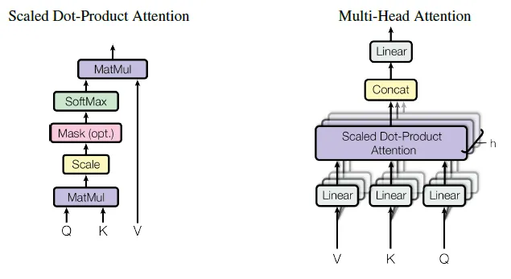

## JAXformers: Learning Transformers Implementation with JAX



This project aims to provide a simple and educational implementation of the Transformer architecture using the JAX library. The purpose is to learn and understand how Transformers work by writing the code from scratch and leveraging the capabilities of JAX for numerical computing and machine learning.

### Project Structure 

The project is organized into the following files:

`attention.py`: Contains the implementation of the scaled dot-product attention mechanism.

`transformer_layer.py`: Defines the multi-head attention and the complete Transformer layer.

`main.py`:  Demonstrates how to use the Transformer layer and perform a simple forward pass.

### Getting Started 

To run the code and experiment with the Transformer layer, follow these steps:

1. Install dependencies 

```python
pip install jax jaxlib
```

2. Clone the repo:

```
git clone https://github.com/pyamin1878/jaxformers
``` 

3. Navigate to the project directory:

```
cd jaxformers
```

4. Run the main script:

```python
python main.py 
```

### Learning Objectives

By exploring and understanding the code in this project, you can learn:

- How the scaled dot-product attention mechanism works.
- How multi-head attention is implemented and used in Transformers.
- The structure and components of a Transformer layer.
- How to use JAX for numerical computations and building neural networks.
- The benefits of using JAX, such as automatic differentiation and XLA compilation.

### Resources


For more information about Transformers and JAX, refer to the following resources:

[Build a Transformer in JAX from scratch: how to write and train your own models](https://theaisummer.com/jax-transformer/)

[Attention is all you need: Discovering the Transformer paper](https://towardsdatascience.com/attention-is-all-you-need-discovering-the-transformer-paper-73e5ff5e0634)

[JAX Quickstart](https://jax.readthedocs.io/en/latest/notebooks/quickstart.html)


